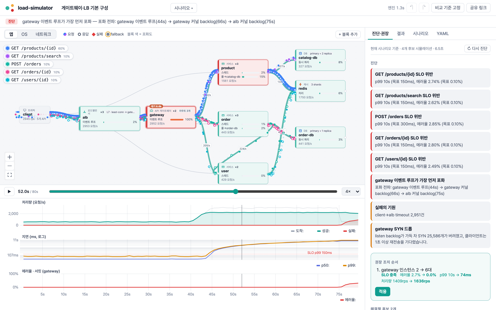
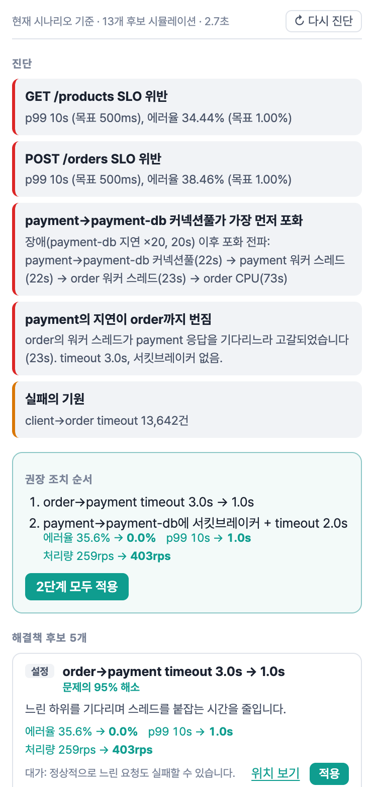
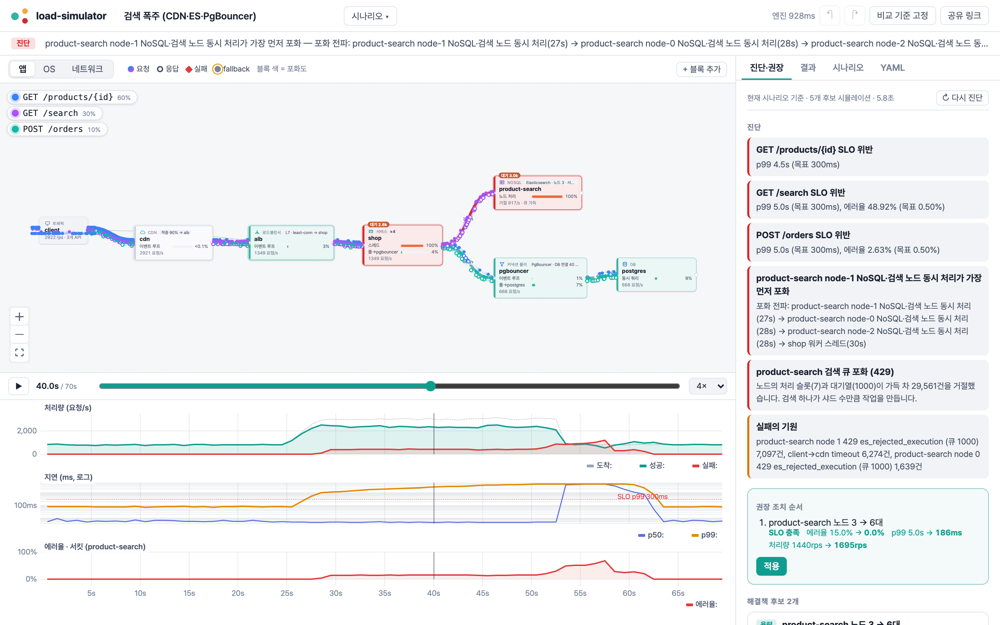
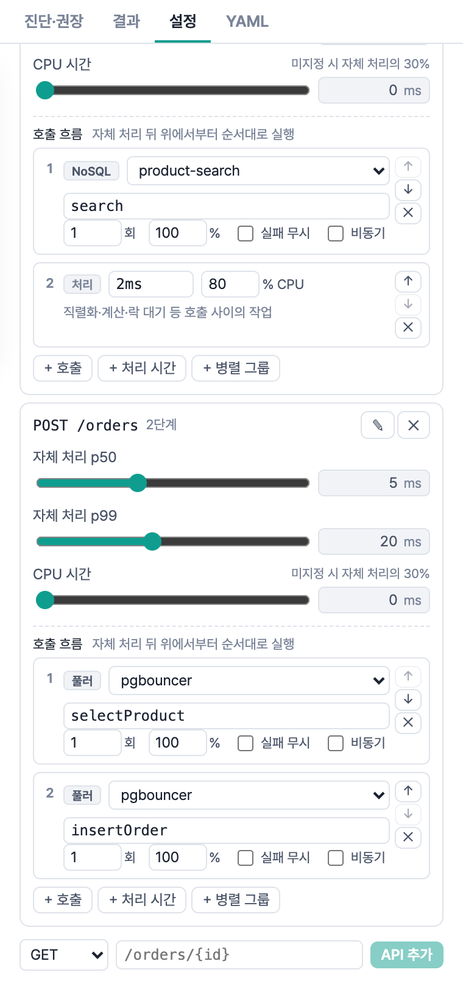
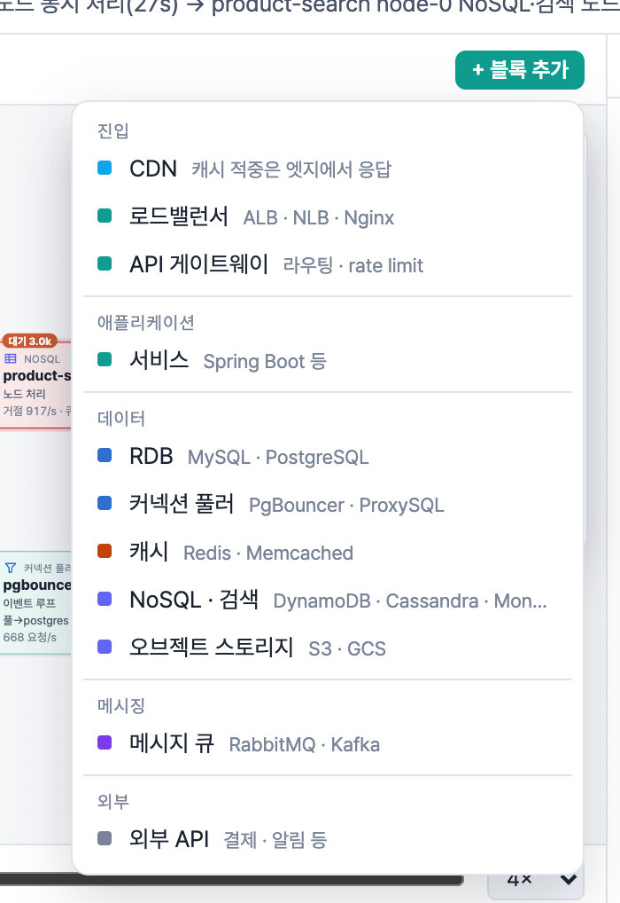
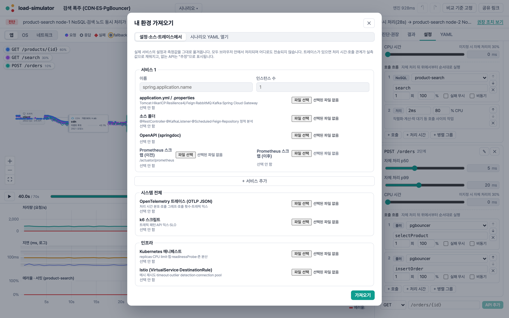

# load-simulator

**백엔드 물리엔진.** 지금 운영 중인 시스템의 설정·소스·트레이스·지표를 그대로 가져와, 애플리케이션·OS·네트워크 3계층을
브라우저에서 순수 계산으로 시뮬레이션합니다. 부하 테스트를 돌리지 않고도 **어디서 먼저 터지는지, 무엇을 바꾸면 막히는지**를
수 초 안에 보여 주고, 같은 시나리오를 실제 부하 테스트(k6 + Toxiproxy)로 실행해 결과를 맞춰 봅니다.



> 위: ALB → 게이트웨이 → 서비스 구성에 트래픽이 5배로 몰린 순간. 게이트웨이(빨간 블록)의 이벤트 루프가 가장 먼저 포화되고,
> 오른쪽 진단 패널은 "게이트웨이 인스턴스 2 → 6대"가 SLO를 지킨다는 것을 시뮬레이션으로 확인해 권장합니다.

## 목차

- [실행 방법](#실행-방법)
- [사용 흐름](#사용-흐름)
- [화면 둘러보기](#화면-둘러보기)
- [다루는 구성 요소](#다루는-구성-요소)
- [예제 시나리오](#예제-시나리오)
- [CLI와 CI](#cli와-ci)
- [실측 검증 하네스와 정확도](#실측-검증-하네스와-정확도)
- [어떻게 동작하나](#어떻게-동작하나)
- [문서·구조·라이선스](#문서)

## 실행 방법

### 필요한 것

| 용도 | 필요 |
|---|---|
| 웹 UI · CLI | Node.js 20 이상, npm |
| 실측 검증 하네스 (선택) | Docker 또는 OrbStack, [k6](https://k6.io/docs/get-started/installation/) |

### 웹 UI

```bash
git clone <이 저장소>
cd load-simulator
npm install
npm run dev
```

브라우저에서 http://localhost:5173 을 엽니다. 처음 열면 세 가지 시작 방법이 나옵니다.

- **내 환경 가져오기** — application.yml, 소스 폴더, 트레이스, Prometheus 스크랩, k6 스크립트, Kubernetes·Istio 설정을 넣습니다.
- **예제로 둘러보기** — 15개 장애 시나리오 중 하나를 엽니다.
- **빈 캔버스에서 그리기** — "+ 블록 추가"로 구성 요소를 놓고 연결합니다.

작업한 시나리오는 브라우저에 자동 저장되고(시나리오 ▾ → 내 시나리오), "공유 링크"로 URL 하나에 담아 보낼 수 있습니다.
`examples/`에 YAML 파일을 넣으면 개발 서버를 다시 띄우지 않아도 예제 목록에 바로 나타납니다.

### 정적 빌드

```bash
npm run build                      # CLI 번들 + 웹 정적 파일 (packages/web/dist)
npm run preview -w @load-simulator/web   # 빌드 결과 확인 (http://localhost:4173)
```

`packages/web/dist`는 서버가 필요 없는 정적 파일이라 GitHub Pages·S3 등 어디에나 올릴 수 있습니다. 계산은 모두 브라우저 안(Web Worker)에서 하고,
가져온 설정·트레이스는 어디로도 전송되지 않습니다.

### CLI

```bash
npm run build -w @load-simulator/cli
npm run sim -- run examples/01-cascading-failure.yaml       # 또는 node packages/cli/dist/load-sim.cjs …
```

### 테스트

```bash
npm test            # 엔진 테스트 (큐잉 이론 해석해, 장애 거동, 권장 엔진이 예제를 스스로 푸는지 등)
npm run typecheck
```

## 사용 흐름

1. **옮겨 온다** — "내 환경 가져오기"에 설정·소스·트레이스·지표를 넣으면 노드·API·호출 관계·처리 시간·풀 크기·타임아웃이 채워집니다.
   같은 API를 여러 출처가 말하면 **트레이스 > Prometheus > 설정 > 소스·OpenAPI** 순으로 믿고, 트레이스에 없는 API는 "추정"으로 표시합니다.
2. **돌려 본다** — 트래픽 패턴(스파이크·램프·단계)과 장애(지연·오류·단절·인스턴스 다운·존 장애·캐시 만료 …)를 정하면 바로 시뮬레이션합니다.
   재생 막대로 시간을 오가며 어느 블록이 먼저 붉어지는지 봅니다.
3. **진단을 읽는다** — 진단·권장 탭이 가장 먼저 포화된 자원과 전파 경로, 실패의 기원을 보여 줍니다.
4. **권장 조치를 적용한다** — 해결책 후보를 같은 시나리오·시드로 하나씩 시뮬레이션해 **효과가 확인된 것만** 효과 순으로 보여 줍니다.
   "적용"을 누르면 시나리오가 바뀌고 이전 결과가 비교 기준으로 겹쳐 보입니다.
5. **실제로 확인한다** — 같은 시나리오를 `load-sim k6`·`load-sim toxiproxy`로 실제 부하 테스트로 돌리고, `load-sim compare`로 오차를 봅니다.

## 화면 둘러보기

### 진단과 권장



결제 DB가 20배 느려지는 [예제 1](examples/01-cascading-failure.yaml)의 진단입니다.

- **가장 먼저 포화된 자원**: payment→payment-db 커넥션풀(22초) → payment 워커 스레드 → order 워커 스레드로 번진 순서
- **실패의 기원**: 클라이언트가 본 에러가 실제로 어디서 시작됐는지
- **권장 조치 순서**: 후보를 하나씩 적용해 다시 시뮬레이션한 결과로, 여러 단계를 합친 효과(에러율 35.6% → 0%, p99 10s → 1.0s)까지 보여 줍니다
- 효과가 없거나 오히려 나빠지는 후보는 보이지 않습니다

각 후보에는 **대가**(비용, 기능 저하, 코드 변경)가 함께 적혀 있습니다.

<br clear="right">

### 요청 흐름

화면의 입자는 표본 요청입니다. **API마다 색이 다르고**(왼쪽 위 목록, 클릭하면 그 API만 강조), 채워진 점은 요청, 빈 원은 응답,
빨간 마름모는 실패, 노란 테두리는 fallback 응답입니다. API마다 연결선 위 다른 차선을 쓰므로 여러 흐름이 겹쳐도 구분됩니다.
블록 색은 포화도이고, "대기 n"은 그 순간 기다리는 요청 수입니다.



> [예제 15](examples/15-search-spike.yaml): 상품 상세는 CDN이 막아 주지만 캐시되지 않는 검색이 몰리면 검색 하나가 샤드 5개에 작업을 만들어
> Elasticsearch 스레드풀이 차고(429), 기다리는 검색이 shop 스레드를 붙잡아 주문까지 실패합니다. 권장 조치는 "데이터 노드 3 → 6대".

### API 호출 흐름 편집



서비스를 선택하고 **설정 → API**에서 API를 추가·이름 변경·삭제하고, API마다 무엇을 어떤 순서로 호출하는지 정합니다.

- **+ 호출**: DB·풀러·캐시·NoSQL·큐·다른 서비스·외부 API. 반복 횟수(N+1), 실행 확률, 실패 무시, `@Async`
- **+ 처리 시간**: 호출 사이의 직렬화·계산·락 대기와 그중 CPU 비율
- **+ 병렬 그룹**: 동시에 보내고 모두 끝날 때까지 대기 (`CompletableFuture.allOf`, `Mono.zip`)
- 캐시 호출에는 **미스일 때** 실행할 경로(cache-aside)를 붙입니다
- ↑↓로 순서를 바꿉니다

새 API는 "트래픽 없음 · 추가"로 트래픽 믹스에 넣습니다.

<br clear="right">

### 블록 추가와 내 환경 가져오기



"+ 블록 추가"는 시스템에서 놓이는 자리별로 묶여 있습니다. 블록 오른쪽 점을 다른 블록으로 끌면 "어느 API가 어떤 오퍼레이션을 호출하는지"를 고르는 창이 뜹니다.

<br clear="right">



## 다루는 구성 요소

| 계층 | 구성 요소 | 모델링하는 동작 |
|---|---|---|
| 진입 | CDN, 로드밸런서(L4/L7), API 게이트웨이 | 엣지 캐시 적중(경로별), 분산 알고리즘(round-robin·least-conn·p2c), 헬스체크 공백, 라우트 rate limit(429) |
| 애플리케이션 | Spring(Tomcat·WebFlux·가상 스레드) | 스레드·accept-count·이벤트 루프·pinning, Resilience4j(서킷브레이커·재시도·TimeLimiter·Bulkhead·RateLimiter·fallback), @Async, @Scheduled |
| OS | JVM, 컨테이너, 커널 | CPU 경합과 컨텍스트 스위칭, GC 정지, cgroup CFS 쓰로틀링, somaxconn·SYN 드롭, 파일 디스크립터, 임시 포트·TIME_WAIT |
| 네트워크 | 연결선 | RTT·지터·손실(빠른 재전송 vs RTO), TLS·keep-alive 핸드셰이크, 대역폭, 존 사이 지연 |
| 데이터 | RDB, 커넥션 풀러, 캐시, NoSQL·검색, 오브젝트 스토리지 | HikariCP·DB 경합 곡선, 샤딩·레플리카·failover, PgBouncer 다중화, Redis Cluster·TTL 스탬피드·single flight, DynamoDB 핫 파티션 스로틀링, Cassandra 일관성 수준, MongoDB primary 선출, Elasticsearch 샤드 fan-out·429, S3 prefix 한도 |
| 메시징 | RabbitMQ, Kafka | prefetch·ack·DLQ·quorum 큐, 파티션·키 쏠림·리밸런스·리더 선출·min ISR |
| 플랫폼 | 서비스 메시, 가용 영역, WebSocket | 사이드카 지연·메시 재시도·outlier detection, 존 장애·존 인지 라우팅, 연결 고정·브로드캐스트·재연결 폭주 |

전체 필드는 [YAML 레퍼런스](docs/model-reference.md)에 있습니다. 시나리오 YAML 예:

```yaml
nodes:
  order:
    instances: 2
    runtime: { threads: 200 }
    os: { vcpu: 2, heap: 2g }
    endpoints:
      POST /orders:
        selfTime: { p50: 8ms, p99: 40ms }
        calls:
          - { call: "redis:GET product", onMiss: [ "orders-db:selectProduct" ] }
          - parallel: [ "stock:GET /stocks/{id}", "coupon:GET /coupons" ]
          - { work: 3ms, cpu: 50% }
          - "payment:POST /payments/approve"
          - "order-events:publish"
edges:
  order->payment:
    timeout: 2s
    retry: { max: 3, backoff: exponential, jitter: true }
    circuitBreaker: { failureRate: 50, slowCall: 1s, window: 100, openFor: 10s }
scenario:
  traffic: { type: spike, base: 500rps, peak: 5000rps, at: 60s, mix: { "GET /products": 70%, "POST /orders": 30% } }
  faults:
    - { target: payment-db, at: 90s, latencyX: 10 }
  slo: { p99: 300ms, errorRate: 0.1% }
```

## 예제 시나리오

예제에는 문제만 적혀 있고 해결책은 없습니다. 진단·권장 탭이 찾아내고, 테스트가 매번 확인합니다.

| # | 예제 | 무엇이 터지나 |
|---|---|---|
| 1 | [결제 DB 지연 → 연쇄 장애](examples/01-cascading-failure.yaml) | 결제 DB가 느려지면 스레드가 차례로 고갈되어 상관없는 상품 조회까지 실패 |
| 2 | [재시도 폭풍](examples/02-retry-storm.yaml) | 세 계층의 재시도가 곱해져 최하위 요청이 최악 27배 |
| 3 | [이벤트 오픈 용량 산출](examples/03-event-capacity.yaml) | 트래픽 10배 스파이크에서 CPU 포화 |
| 4 | [GC 일시정지 연쇄](examples/04-gc-pause.yaml) | 큰 힙의 Old GC 정지가 상위 timeout과 재시도를 부름 |
| 5 | [소켓 backlog 넘침](examples/05-backlog-overflow.yaml) | accept 대기열이 차서 SYN 드롭 → 1초·3초 재전송 |
| 6 | [패킷 손실 1%](examples/06-packet-loss.yaml) | 꼬리 손실의 RTO 대기가 p99를 끌어올림 |
| 7 | [캐시 스탬피드](examples/07-cache-stampede.yaml) | 같은 TTL로 채워진 키가 동시에 만료되어 DB로 몰림 |
| 8 | [큐 컨슈머 지연과 회복](examples/08-queue-recovery.yaml) | 컨슈머가 느려진 동안 쌓인 메시지가 회복을 늦춤 |
| 9 | [헬스체크 공백](examples/09-health-check-gap.yaml) | 무응답 인스턴스로 계속 보내는 로드밸런서 |
| 10 | [Kafka 파티션 지연](examples/10-kafka-partition-lag.yaml) | 핫 키 파티션 하나만 밀리고 컨슈머는 놂 |
| 11 | [가용 영역 장애](examples/11-zone-outage.yaml) | 한 존에만 있던 서비스가 존과 함께 멈춤 |
| 12 | [게이트웨이·LB 기본 구성](examples/12-gateway-lb-baseline.yaml) | 5배 트래픽에 게이트웨이 CPU가 먼저 포화 |
| 13 | [실시간 채팅 (WebSocket)](examples/13-websocket-chat.yaml) | 인스턴스가 죽으면 끊긴 클라이언트가 동시에 재연결해 폭주 |
| 14 | [DynamoDB 핫 파티션](examples/14-dynamodb-hot-partition.yaml) | 전체 용량은 남는데 인기 상품 키의 파티션만 스로틀링 |
| 15 | [검색 폭주 (CDN·ES·PgBouncer)](examples/15-search-spike.yaml) | 캐시되지 않는 검색이 Elasticsearch 스레드풀을 채우고 shop 스레드까지 붙잡음 |

## CLI와 CI

```bash
alias load-sim="node $(pwd)/packages/cli/dist/load-sim.cjs"

load-sim run scenario.yaml --report report.md        # 시뮬레이션 + 마크다운 리포트
load-sim check scenario.yaml                         # 정적 검사: timeout 역전, 재시도 증폭, timeout 없음 …
load-sim capacity scenario.yaml --p99 300ms --min-rps 1500   # SLO 한계 RPS와 첫 병목. 기준 미달이면 exit 1
load-sim import --service order --spring-src ./order --application ./order/src/main/resources/application.yml \
  --traces traces.json --prometheus before.txt,after.txt --seconds 60 --k6 load.js \
  --k8s deploy.yaml --zones a,b,c --istio istio.yaml --out scenario.yaml   # 실제 환경 → 시나리오
load-sim k6 scenario.yaml --out load.js --allow staging.internal   # 같은 시나리오를 k6 스크립트로
load-sim toxiproxy scenario.yaml --proxies payment-db=mysql        # 시나리오의 장애를 Toxiproxy에 실시간 적용
load-sim spring-env scenario.yaml --service order                  # 시나리오 설정 → Spring 환경 변수
load-sim calibrate scenario.yaml --measured points.json --out calibrated.yaml   # 실측으로 보정
load-sim compare calibrated.yaml --measured measured.json          # 실측 대비 오차표
```

PR마다 용량 회귀를 막습니다. 부하 테스트 환경은 필요 없습니다.

```yaml
# GitHub Actions
- uses: <owner>/load-simulator@main
  with:
    scenario: load/scenario.yaml
    min-rps: 1500
```

```kotlin
// Gradle (gradle-plugin/)
plugins { id("dev.loadsim") }
loadSim {
    scenario = file("load/scenario.yaml")
    minRps = 1500
}
```

## 실측 검증 하네스와 정확도

[harness/](harness/)는 Spring Boot 서비스 3개(order·payment·stock)와 MySQL·Redis·RabbitMQ·Toxiproxy·Prometheus를 docker compose로 띄우고,
**시뮬레이터와 같은 시나리오 파일로** 실제 부하를 겁니다.

```bash
npm run build -w @load-simulator/cli
node harness/run.mjs --validate 200,300 --fault    # Docker(OrbStack)와 k6 필요, 약 12분
```

1. 시나리오 설정을 Spring 환경 변수로 바꿔 띄웁니다(시뮬레이션과 실제 배포가 같은 설정).
2. 워밍업 뒤 낮은 부하(60·90·120 rps)를 재고, 기본 지연·네트워크 RTT·DB 경합 곡선을 보정합니다.
3. 보정에 쓰지 않은 높은 부하(200·300 rps)와 장애 실행(Toxiproxy로 DB 지연 주입)을 예측하고 실측과 비교합니다.
4. 결과는 `harness/out/accuracy-<날짜>.md`에 남습니다.

**첫 실측 결과 (2026-10-03, M2 Pro 노트북 + OrbStack)**: 처리량(±1%)과 에러율은 목표 안이고, 장애 시 지연 폭증의 거동도 같습니다.
지연은 30~45% 높게 예측합니다(목표 ±15% 미달). 실제 시스템은 저부하에서 유휴 복귀 비용 때문에 오히려 느린데 모델에 이 효과가 없는 것이
주 원인입니다. 자세한 표와 분석은 [docs/accuracy.md](docs/accuracy.md)에 있고, **그래서 아직 "부하 테스트를 대체한다"고 주장하지 않습니다.**

## 어떻게 동작하나

엔진은 렌더링과 분리된 순수 함수 `simulate(model, scenario, seed) → result`인 **이산 사건 시뮬레이션**입니다.

- 세 계층이 **사건 큐 하나를 공유**합니다. "GC 정지 → 스레드 점유 증가 → 상위 timeout → 재시도" 같은 계층을 넘는 연쇄가 그대로 재현됩니다.
- 시드를 고정한 난수만 씁니다. 같은 입력이면 같은 결과가 나오므로 A/B 비교, 권장 조치 평가, URL 공유가 의미를 가집니다.
- 지표는 모든 요청으로 정확히 계산하고, 화면의 입자는 표본 요청만 그립니다.
- 계산은 Web Worker에서 돌고, 예제 하나는 브라우저에서 1초 안팎에 끝납니다.

설계와 단순화한 부분은 [docs/architecture.md](docs/architecture.md)에 적어 두었습니다.

| 상황 | 대체 여부 |
|---|---|
| 설정 변경(풀 크기, timeout, 재시도, 인스턴스 수, 일관성 수준)의 영향 | 대체 가능 (모델이 직접 다루는 변수) |
| 같은 코드에서 트래픽 증가 시 용량 | 대체 가능 (보정 데이터가 있을 때) |
| 새 기능·새 쿼리 추가 | 부분 대체 (새 경로의 처리 시간은 측정해 입력) |
| 메모리 누수, 락 경합, 라이브러리 버그 | 대체 불가 (모델에 없는 동작) |

## 문서

- [기획서](docs/spec.md) — 배경, 목표, 계층별 모델, 화면, 리스크
- [엔진 설계](docs/architecture.md) — 구현된 모델과 알려진 한계
- [YAML 레퍼런스](docs/model-reference.md)
- [정확도](docs/accuracy.md) — 검증 방법과 실측 결과
- [로드맵](docs/roadmap.md)
- [하네스](harness/README.md)

## 구조

```
packages/engine   시뮬레이션 엔진, 가져오기, 진단·권장, 보정 (TypeScript, 의존성: yaml)
packages/web      웹 UI (React, React Flow, uPlot)
packages/cli      load-sim CLI
gradle-plugin/    Gradle 플러그인 (capacity 검사를 check에 연결)
harness/          실측 검증 하네스 (Spring Boot + docker compose + k6)
examples/         예제 시나리오
docs/             문서 (images/는 README 스크린샷)
```

## 라이선스

[MIT](LICENSE). 기여 방법은 [CONTRIBUTING.md](CONTRIBUTING.md)를 보세요.
